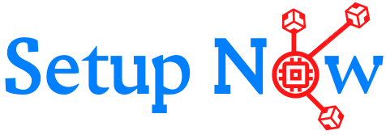
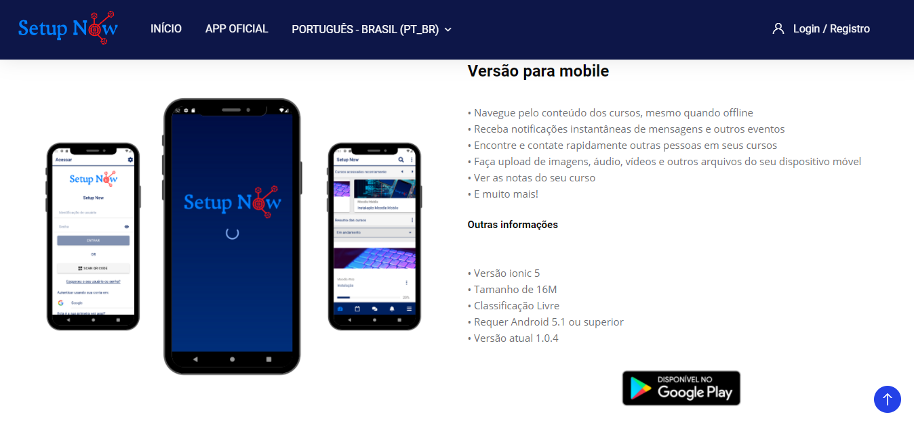

  
 

<h1 align="center">
    
</h1>

<h4 align="center"> 
	🚧  Learning Managemente System 🚧
</h4>

## 💻 Sobre o projeto

🧭 Sistema modular moodle - sendo um software open-source sob a licença GNU Public License, um sistema de apoio a aprendizagem que teve seu início em meados de 2001 pelo educador e cientista computacional Martin Dougiamas. Sua principal linguagem de desenvolvimento ocorre em PHP, podendo ser executado em ambientes como Unix, Windows, Mac OS e Linux. Por ser um sistema altamente modular, ja foi apelidado como frankenstein pela sua aceitação de diversas sofisticações de acordo com a necessidade para atender diversas demandas envolvendo o ramo da educação.

---

## ⚙️ Algumas das funcionalidades existentes

- [x] Funcionalidade para relatórios
- [x] Diversos modelos de autenticação
- [x] Gerenciar cursos e categorias
- [x] Gerenciar idiomas
- [x] Sistema constituído por módulos e blocos
- [x] Customização de aparência da plataforma
- [x] instalção de plugins para novas funcionalidades
- [x] Modelos de segurança automáticas
- [x] Configuração do curso
- [x] Realizar gestão de perfil e níveis de usuários
- [x] Análise de atividades e desempenho de usuários
- [x] Desenvolvimento de novos plugins
- [x] Customização da plataforma para novas funcionalidades internas
- [x] Integração com outros sistemas
- [x] Disponibilidade de acesso mobile (dedico a alunos e professores)

---

## 🎨 Layout

### Web

---

## 🚀 Algumas ferramentas nessárias para o desenvolvimento

💡Para a execução da aplicação ou desenvolvimento é necessário algumas ferramentas.

### Pré-requisitos

Ao utilizar este software, será preciso executá-lo em um ambiente linux ou até mesmo no Windows utilizando ferramentas como VirtualBox ou utilizando Xampp/WampServer, uma configuração com banco de dados, abaixo ferramentas essenciais para o desenvolvimento:
- [Git](https://git-scm.com)
- [Apache NetBeans](https://netbeans.apache.org/download/index.html)
- [Xampp](https://www.apachefriends.org/pt_br/index.html)
- [WampServer](https://www.wampserver.com/en/)
- [VirtualBox](https://www.virtualbox.org/)

---

## 🛠 Tecnologias

As seguintes ferramentas foram usadas na construção do projeto:

- **[PHP](https://www.php.net/manual/pt_BR/intro-whatis.php)**
- **[JavaScript](https://developer.mozilla.org/pt-BR/docs/Web/JavaScript/Guide)**
- **[Gherkin](https://cucumber.io/docs/gherkin/)**
- **[CSS](https://developer.mozilla.org/pt-BR/docs/Web/CSS)**
- **[Mustache](https://mustache.github.io/)**
- **[Html](https://developer.mozilla.org/pt-BR/docs/Web/HTML)**

---

## 💪 Como contribuir para o projeto

1. Faça um **fork** do projeto.
2. Crie uma nova branch com as suas alterações: `git checkout -b my-feature`
3. Salve as alterações e crie uma mensagem de commit contando o que você fez: `git commit -m "feature: My new feature"`
4. Envie as suas alterações: `git push origin my-feature`

---

## 🦸

<a href="https://setupnow.com.br/portfolio.html#portifolio">
 
  
 <b>Weslley</b></a> <a href="https://setupnow.com.br/portfolio.html#portifolio" title="Setup Now">🚀</a>
  

---

## 📝 Licença

Este projeto esta sobe a licença [GNU](https://github.com/Weslley95/lms_setupnow_3.11/blob/master/moodle/COPYING.txt).

👋🏽 [Entre em contato!](https://www.linkedin.com/in/weslley-bezerra-451576125/)

---
